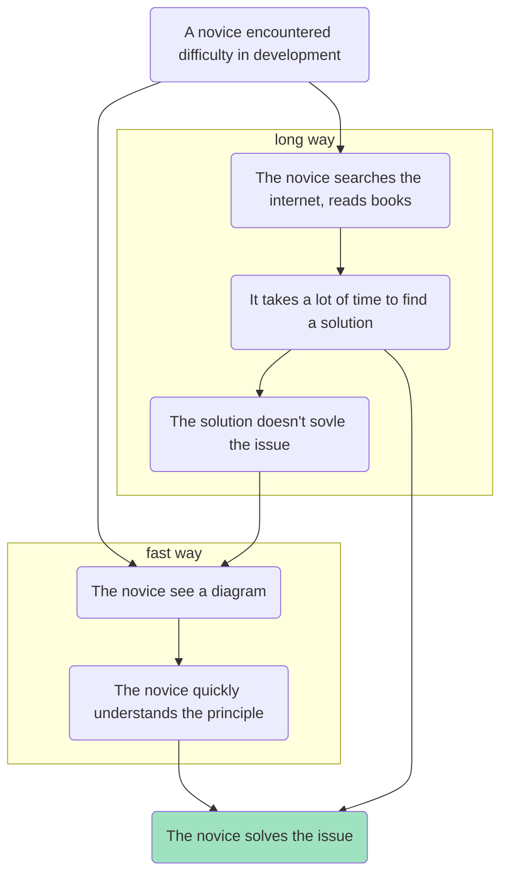

# learn-processes-with-schemes
Learn processes with schemes

## What it is
Here you can find diagrammed instructions of various operations performed in order to learn different topics.

These instructions are primarily intended for beginners. That is why I chose diagrams. They are of mermaid diagrams and look like this:

You are welcome to contribute by finding a question in the issues section you have answer to. You do pull-requests and I'll merge.

## License
This content is licensed under the Creative Commons Attribution-NonCommercial-NoDerivs license (CC BY-NC-ND). You are free to view, read and share the content with others as long as you credit the author and provide appropriate attribution. Any modifications, reusing it in other works or commercial use are not permitted under this license. All rights are reserved by the author.
