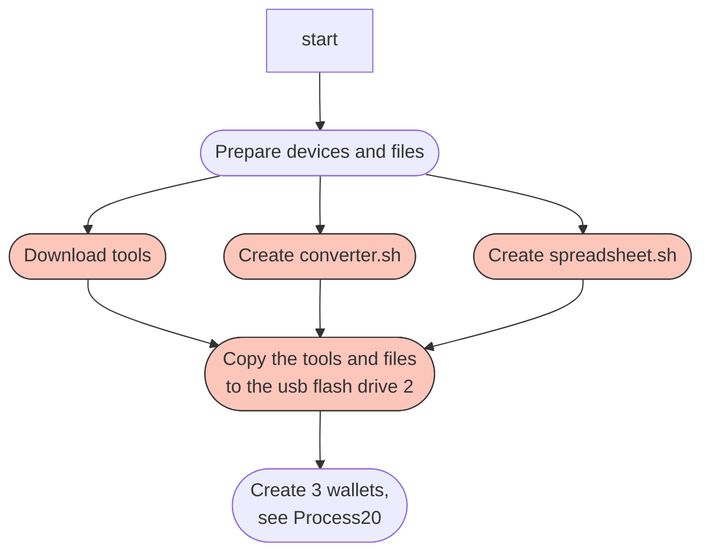

# Bitcoin process
aa

## What it is
Create a multi-wallet bitcoin infrastructure for private and secure using it.

```mermaid
flowchart TD
start --> prepare --> download_tools & create_converter & create_spreadsheet 
    --> copy_tools --> 3_wallets;

prepare([Prepare devices and files])
download_tools([Download tools])
create_converter([Create converter.sh])
create_spreadsheet([Create spreadsheet.sh])
copy_tools(["Copy the tools and files 
    to the usb flash drive 2"])
3_wallets(["Create 3 wallets, 
    see Process20"])

click prepare "https://github.com/cardinal-II/learn-processes-with-schemes/blob/main/bitcoin/Prepare%20devices%20and%20files.md" "Open" _blank

click download_tools "https://github.com/cardinal-II/learn-processes-with-schemes/blob/main/bitcoin/Download%20tools.md" "Open" _blank

click 3_wallets "https://github.com/cardinal-II/learn-processes-with-schemes/blob/main/bitcoin/_process20.md" "Open" _blank

style download_tools fill:#FCC6BB, stroke:#333;
style create_converter fill:#FCC6BB, stroke:#333;
style create_spreadsheet fill:#FCC6BB, stroke:#333;
style copy_tools fill:#FCC6BB, stroke:#333;

```

aa