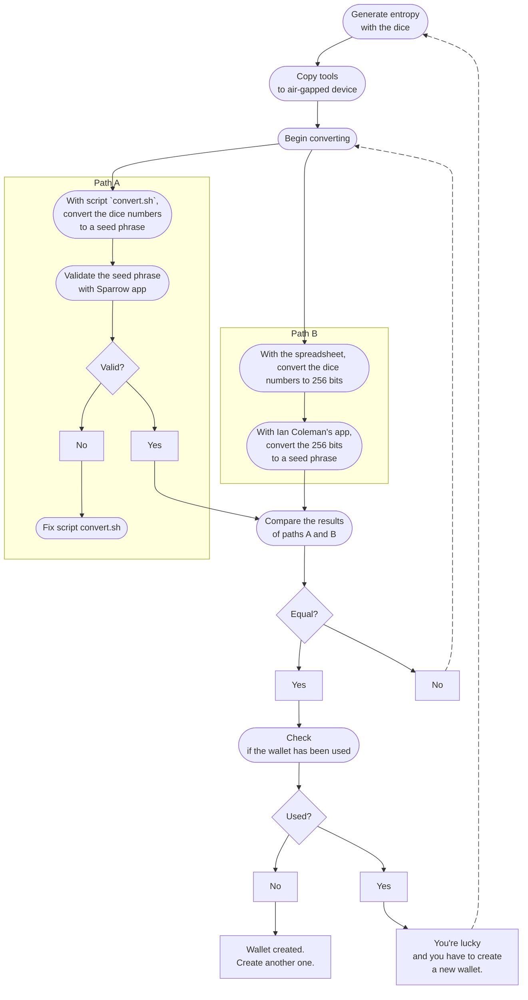

aa

```mermaid
flowchart TD
    entropy --> copy_tools_to_airgapped --> begin_converting --> convert_numbers_a & convert_numbers_b;
    subgraph Path A
        convert_numbers_a --> validate_seed --> valid1 --> yes1 & no1;
        no1 --> fix_script;
        end
    subgraph Path B
        convert_numbers_b --> ian_coleman;
        end
    yes1 & ian_coleman --> compare_paths --> equal --> yes2 & no2;
    no2 e1@--> begin_converting;
    yes2 --> check_used --> used --> no3 & yes3;
    yes3 --> lucky e2@--> entropy;
    no3 --> wallet_created;
    
entropy(["Generate entropy 
    with the dice"]);
copy_tools_to_airgapped(["Copy tools 
    to air-gapped device"]);
begin_converting([Begin converting]);
convert_numbers_a(["With script `convert.sh`,
    convert the dice numbers 
    to a seed phrase"]);
validate_seed(["Validate the seed phrase
    with Sparrow app"])
valid1{Valid?}
yes1[Yes]
no1[No]
fix_script([Fix script convert.sh])
convert_numbers_b(["With the spreadsheet, 
    convert the dice numbers to 256 bits"])
ian_coleman(["With Ian Coleman's app, 
    convert the 256 bits 
    to a seed phrase"])
compare_paths(["Compare the results 
    of paths A and B"])
equal{Equal?};
yes2[Yes]
no2[No];
e1@{ animation: fast };
e2@{ animation: fast };
check_used(["Check 
    if the wallet has been used"])

used{Used?}
yes3[Yes]
lucky["You're lucky
    and you have to create 
    a new wallet."]
no3[No]
wallet_created["Wallet created. 
    Create another one."]

```

aa