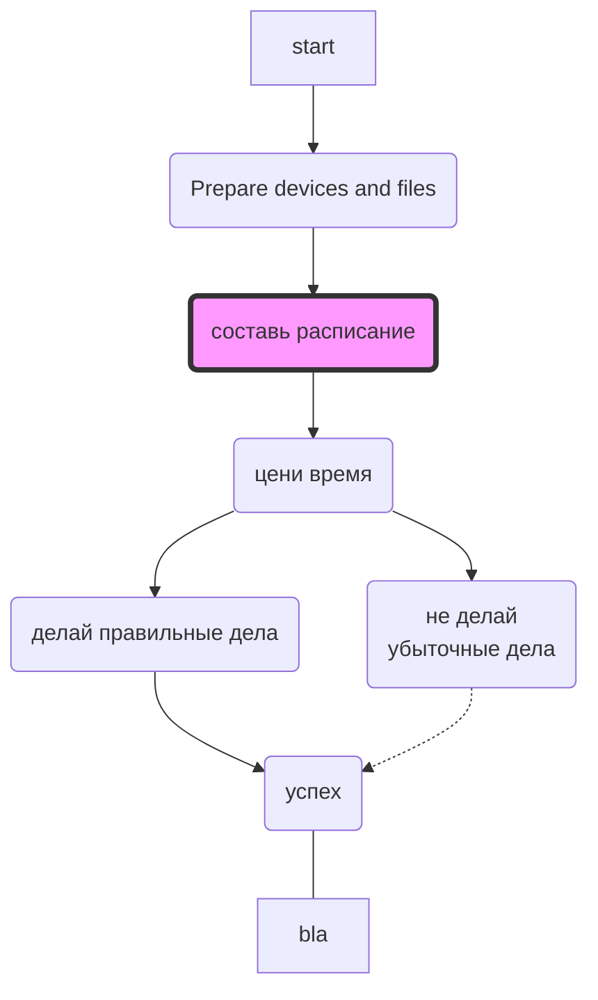
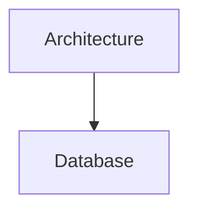

# Bitcoin process
aa

## What it is
Create a multi-wallet bitcoin infrastructure for private and secure using it.

You are welcome to contribute by finding a question in the issues section you have answer to. You do pull-requests and I'll merge.

## License
This content is licensed under the Creative Commons Attribution-NonCommercial-NoDerivs license (CC BY-NC-ND). You are free to view, read and share the content with others as long as you credit the author and provide appropriate attribution. Any modifications, reusing it in other works or commercial use are not permitted under this license. All rights are reserved by the author.
